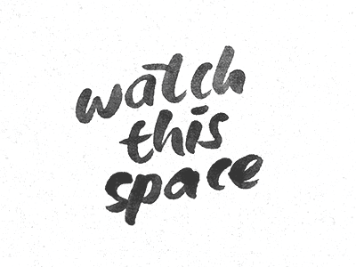

## My Portfolio

**[Test this app yourself](https://aliceheneghan.github.io/my-portfolio/)**

---

#### Navigation

- [About Project](#about-project)
  - _Description_
  - _Developed With_
- [Contact](#contact)
  - _Mail_
  - _GitHub_
  - _LinkedIn_
- [Used Tools](#used-tools)
  - _Fonts_
  - _Design_
  - _Icons_
  - _Colors_

---

### About Project

##### Description

_Personal & Professional Portfolio_  
Create a portfolio using HTML/CSS/SCSS and include:
- Landing page where you have picture of you with a short Bio (who are you)
- Projects gallery (screenshots with GH links for preview and code)
- Personal side of you (hobbies, tool-tack, photos, etc.)
- Your social media links ( Linkedin, GitHub, etc.)
Optional:  
- Menu
- Multi Html pages
- Contact form (will not be active with your current tools)

##### Developed With

- [x] _HTML5_
- [x] _CSS3_
- [ ] _SASS_
- [x] _SCSS_
- [ ] _JavaScript_
- [ ] _React_
- [ ] _Bootstrap_
- [x] _npm_

---

### Contact

Mail: <heneghan31@mail.com> 
GitHub: [aliceheneghan](https://github.com/aliceheneghan) 
LinkedIn: [your linkedIn](https://linkedin.com/in/alicehen)

---

### Used Tools

- [icons](https://)
- [npm](https://www.npmjs.com/)
- [Google Fonts](https://fonts.google.com/)
- [Visual Studio Code](https://code.visualstudio.com/)

---